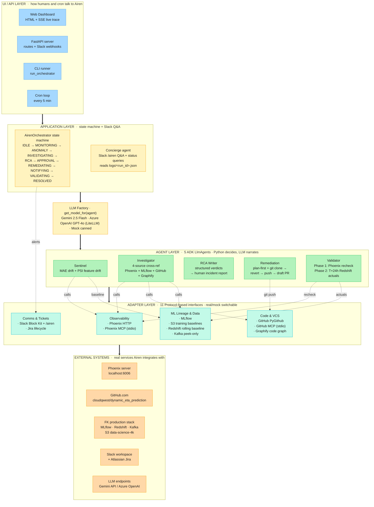

# Airen — Architecture Diagram

> Generated by `scripts/render_architecture.py`. Do not hand-edit.
> For the interactive version, open `docs/airen-architecture.excalidraw`
> in [excalidraw.com](https://excalidraw.com) (drag & drop the file).

## Layer cheatsheet

| Layer | What it contains | File locations |
|---|---|---|
| **UI / API** | Entry points humans hit | `airen/web/`, `airen/run_orchestrator.py` |
| **Application** | State machine + Slack chat agent | `airen/agents/orchestrator.py`, `airen/agents/concierge.py` |
| **LLM Factory** | Model selection per agent | `airen/llm_factory.py` |
| **Agent** | 5 ADK LlmAgents (Sentinel, Investigator, RCA, Remediation, Validator) | `airen/agents/<name>.py` |
| **Adapter** | Protocol + real/mock pairs for every external system | `airen/adapters/*.py` |
| **External** | Real services Airen talks to | n/a (cloud / FK VM) |

## How an incident flows through the system

1. **Trigger** — cron tick, /airen command, or web "Run Now" button
2. **Orchestrator** picks the service, starts a new IncidentRun, walks the state machine
3. **Sentinel** reads Phoenix spans → computes MAE + PSI per segment → returns SentinelVerdict
4. If WARNING/CRITICAL: **Investigator** cross-references Phoenix MCP + GitHub MCP + MLflow + Graphify → returns InvestigatorVerdict with commit/PR/file evidence
5. **RCA Writer** turns the two verdicts into a human-readable IncidentReport
6. **Remediation** drafts a RemediationPlan (revert / hotfix / no-op). Execution gated by 3 flags + confidence ≥ 0.7
7. Orchestrator posts Slack alert + creates Jira ticket → moves ticket to "In Progress"
8. (Optional, if --execute) Remediation does real `git clone → git revert → push → draft PR`
9. **Validator** Phase 1 re-queries Phoenix to confirm the fix; Phase 2 runs at T+24h via Redshift
10. On Phase 1 PASS: Jira → "Done". Otherwise: leave open for human.

Each step writes a structured event to `logs/<run_id>.json`. The SSE stream tails this file so the web UI shows the trace live.
